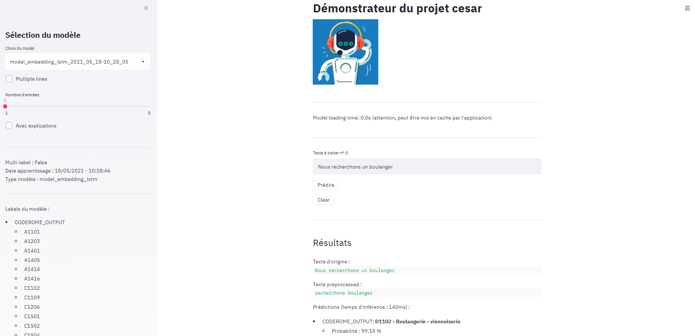

# Gabarit - Templates Data Science

Gabarit provides you with a set of python templates (a.k.a. frameworks) for your Data Science projects. It allows you to generate a code base that includes many features to speed up the production and testing of your AI models. You just have to focus on the core of Data Science.

---

# Licence

This project is distributed under the GNU AFFERO GENERAL PUBLIC LICENSE V3.0. Please check the LICENSE file.

---

# Table of Contents
- [1. Philosophy](#philosophy)
	- [1.1 Frameworks](#frameworks)
	- [1.2 Guidelines](#guidelines)
	- [1.3 Prerequisites](#prerequisites)
- [2. Usage](#usage)
	- [2.1 Installation](#installation)
	- [2.2 Kickstart a new project](#newproject)
	- [2.3 Setup the new project](#setup)
	- [2.4 General principles](#principles)
	- [2.5 Main steps of a given project](#steps)
	- [2.6 Data formats](#format)
- [3. Features](#features)
	- [3.1 Model saving and reloading](#save)
	- [3.2 Third party AI modules](#modules)
	- [3.3 DVC](#dvc)
	- [3.4 MLFlow](#mlflow)
	- [3.5 Streamlit demonstrator](#streamlit)
	- [3.6 Exploratory Data Analysis (EDA)](#eda)
	- [3.7 Misc.](#misc)
- [4. Industrialization](#indus)
	- [4.1 Principe](#principles2)
	- [4.2 Update your model](#upd)
	- [4.3 Unit tests](#ut)
- [5. Differences between the frameworks](#differences)
	- [5.1 NLP Framework](#nlp)
	- [5.2 Numeric framework](#numeric)
	- [5.3 Computer Vision framework](#vision)
- [6. Misc.](#misc2)
- [7. Security warning](#security)
- [8. Ethics](#ethics)
- [9. Contacts](#contacts)

## 1. Philosophy 

As a team, we strive to help Data Scientists across the board (and ourselves!) build awesome IA projects by speeding up the development process. This repository contains several frameworks allowing any data scientist, IA enthousiast (or developper of any kind, really) to kickstart an IA project from scratch.  

We hate it when a project is left in the infamous POC shadow valley where nice ideas and clever models are forgotten, thus we tried to pack as much production-ready features as we could in these frameworks.  

As Hadley Wickhman would say: "you can't do data science in a GUI". We are strong believers that during a data science or IA project, you need to be able to fine tune every nooks and crannies to make the best out of your data.  

Therefore, these frameworks act as project templates that you can use to generate a code base from nothing (except for a project name). Doing so would allow your fresh and exciting new project to begin with loads of features on which you wouldn't want to focus this early :
- Built-in models: from the ever useful TF/IDF + SVM to the more recent transformers
- Model-agnostic save/load/reload : perfect to embed your model behind a web service
- Generic training/predict scripts to work with your data as soon as possible
- DVC & MLFlow integration (you have to configure it to point to your own infrastructures)
- Streamlit demo tool
- ... and so much more !

### 1.1 Frameworks 

Three IA Frameworks are available:

- **NLP**, to tackle classification use cases on textual data

	-	Relies on the Words'n fun module for the preprocessing requirements

	-   Supports :

		- Mono Class / Mono Label classification

		- Multi Classes / Mono Label classification

		- Mono Class / Multi Labels classification

- **Numeric** to tackle classification and regression use cases on numerical data

	- Supports :

		- Regression
		- Multi Classes / Mono Label classification
		- Mono Class / Multi Labels classification

- **Computer Vision** to tackle classification use cases on images

	- Supports

		- Mono Class / Mono Label classification
		- Multi Classes / Mono Label classification
		- Area of interest detection

These frameworks have been developped to manage different subjects but share a common structure and a common philosophy. Once a project made using a framework is in production, any other project can be sent into production following the same process.
Along with these frameworks, an API template has been developped and should soon be open sourced as well. With it, you can expose framework made models in no time !

### 1.2 Guidelines  

Any project generated through one of the framework consists mainly of code: obviously feel free to adapt it to your needs. However we do encourage users to try to keep the overall structure as is so that it would stay consistent with any project created afterwards thus making the whole production steps easier.

Some usual additions to a newly created project:

- Script to download data

- Data transformation script. Here we do not encapsulate preprocessing steps that might be model related but high level data transformation (json to csv, dealing with data duplicates, etc...). Beware that preprocessing steps should be kept as close to the model as possible to ensure that the preprocessing pipeline can be serialized along with the model (thus enabling its reuse in a production environement).

- etc...

- Feel free to contribute and add (through a MR) any additionnal feature that you deem necessary and that could be useful to others in the future

### 1.3 Prerequisites  

To use these frameworks, you should already have python >= 3.7 installed. Note that this project started in python 3.7 but is now tested with python 3.8.
Obviously any prior knowledge of the holy trinity of python ML modules (pandas, sklearn, numpy) alongside Deep Learning frameworks (torch & tensorflow/keras) would be incredibly useful.

## 2. Usage  

### 2.1 Installation  

We packaged this project such that it can be directly installed from PyPI : `pip install gabarit` .  
However, it is not really necessary as this just intalls Jinja2==3.0.3 and adds some entry points. Basically you can manually install Jinja2 `pip install Jinja2==3.0.3` and you'll be able to generate new projects by calling the `generate_XXX_project.py` files individually.  

In the following we consider that you installed the project through pip, which enables entry points. Each entry point refers to a corresponding package generation file.

### 2.2 Kickstart a new project  

Each individual framework has a `generate_XXX_project` entry point that creates a new project code base.
They take several parameters as input :

- **'-n'** or **'--name'** : Name of the package/project (lowercase, no whitespace)
- **'-p'** or **'--path'** : Path (Absolute or relative) where to create the main directory of the project
- **'-c'** or **'--config'** : Path (Absolute or relative) to a .ini configuration file.  
	An default configuration file is given alongside each project. (`default_config.ini`).
	It usually contains stuff like default encoding, default separator for .csv files, pip proxy settings, etc.
- **'--upload'** or **'--upload_intructions'** : Path (Absolute or relative) to a file that contains a list of instructions to upload a trained model to your favorite storage solution.
- **'--dvc'** or **'--dvc_config'** : Path (Absolute or relative) to a DVC configuration file. If not provided, DVC won't be used.

Example : `generate_nlp_project -n my_awesome_package -p my_new_project_path -c my_configuration.ini --upload my_instructions.md --dvc dvc_config`

### 2.3 Setup the new project  

- (Optionnal) We strongly advise to create a python virtual env

	- `pip install virtualenv`

	- `python -m venv my_awesome_venv`

	- `cd my_awesome_venv/Scripts/ && activate` (windows) or `source my_awesome_venv/bin/activate` (linux)

- Requirements : `pip install --no-cache-dir -r requirements.txt`

- Setup the project (in develop mode) : `python setup.py develop`

If the `make` tool is available, you can use the features provided in `Makefile`:

- `create-virtualenv`
and
- `init-local-env`

### 2.4 General principles  

- Data must be kept in a directory named `project_name-data/` located at the root folder of the project (i.e. where `setup.py` is).

- Any data mapping or lookup can be kept under `project_name-data/sources/`. Warning : we're talking small files (< 1 Mo). Larger files should be managed through DVC (or git lfs for that matter).

- Embedding files or equivalent should also be kept under `project_name-data/`.

- Transformers models (e.g. Flaubert) should be kept under `project_name-transformers/` at the root directory of the project.

- Trained models that you built and trained are automatically saved under `project_name-models/`.

- Sklearn preprocessing pipelines (mainly from the numerical framework) are automatically stored within `project_name-pipelines/`.

- The Computer Vision template has some more subdirectories in the `project_name-data/` folder:

	- `cache_keras`: subfolder that replaces the default keras' cache folder. Used with transfer learning classifiers.

	- `transfer_learning_weights`: subfolder that holds networks weights to be used with custom Faster RCNN implementation.

	- `detectron2_conf_files`: subfolder that holds all necessary configuration files to be used with the detectron2 models.

- The `tests/` directory contains numerous unit tests allowing to automatically validate the intended behaviour of the different features. It is of utter importance to keep them up to date depending on your own developments to ensure that everything is working fine. Feel free to check already existing test files if you need some directions. Note that to launch a specific test case you just have to run : `python test_file.py`; for instance: `python tests/test_model_tfidf_dense.py`.

- Numbered files contained in `project_name-scripts/` (e.g. `2_training.py`) hint the main steps of the project. They are indicative but we strongly advise to use them as it can speed up the development steps. It orchestrates the main features of this project: utils functions, preprocessing pipelines and model classes.

- The `preprocess.py` file contains the different preprocessing pipeline available by default by the package/project. More specifically, it contains a dictionnary of the pipelines. It will be used to create working datasets (for instance training set, valid test and test set).

-	Beware that the first row of each generated csv file after running a preprocessing will contain the name of the preprocessing pipeline applied such that it can be reused in the future. Hence, this row (e.g. `#preprocess_P1`) is a metadata and **it has to be skipped** while parsing the csv file. Our templates provide a function (`utils.read_csv`) that does it automatically (it also returns the metadata).

- The modelling part is built as follow :

    - ModelClass : main class that manages how data / models are saved and how performance metrics are computed

    - ModelPipeline : inherits from ModelClass, manages sklearn pipeline models

    - ModelKeras : inherits from ModelClass, manages Keras/Tensorflow models

    - ModelPyTorch : inherits from ModelClass, manages PyTorch models

    - ModelXXX : built-in implementation of standard models used in the industry, inherits from one of the above classes when appropriate

### 2.5 Main steps of a given project  

The intended flow of a project driven by one of these framework is the following:

- 0 – Utility files

    - Split train/valid/test, sampling, embedding download, etc...

- 1 – Preprocessing

- 2 – Model training

    - You can tune the parameters within the script or update the model class depending on your needs

- 3 – Predictions on a dataset

- 4 – Play with a streamlit demonstrator to showcase your models

### 2.6 Data formats  

Input data are supposed to be `.csv` files and the separator and encoding are to be provided during the generation of the project. It is obviously possible to use another datatype but a transformation step to `.csv` will be required to use the scripts provided by default.

Concerning the prediction target, please refer to `2_training.py`. Usually we expect One Hot Encoded format for multi-labels use cases. For single-label use cases, a single column (string for classification, float for regression) is expected.

## 3. Features  

Projects generated through the frameworks provide several main features:

### 3.1 Model saving and reloading  

When a new model is instanciated, a directory is created within `project_name-models/`. It is named after the model type and its date of creation. Each model class exposes a `save` function that allow to save everything necessary to load it back:

- Configuration file

- Serialized object (.pkl)

- "standalone" model

- If Deep Learning : the network weights

- etc.

Thus any model can be loaded through the `utils_models.load_model` function. The "standalone" mode ensures that the model can be loaded even after its code has been modified. Indeed, the .pkl file could be out of sync with the model class (it it was modified after the model had been saved). In this specific case, you can use `0_reload_model.py`.

### 3.2 Third party AI modules  

To this day, 3 main AI modules are used:

- Scikit Learn

- TensorFlow (Keras)

- PyTorch (PyTorch Lightning)

Do no hesitate to extend this list as is the case for LighGBM for instance.

### 3.3 DVC  

A new project can automatically be set up to run in sync with [DVC](https://dvc.org) if you supply the necessary configuration during project generation. We strongly advise to use DVC or similar (git lfs could do the trick) to keep both your code and your datasets synchronized to be able to re-train a model in the same conditions sometime down the line. Please refrain to upload large datasets (>1mo) directly on your version control system. Once setup, dvc configuration is available within `.dvc/`

### 3.4 MLFlow  

A new project can automatically be set up to work alongside a [MLFlow](https://mlflow.org) instance. If you supply a MLFlow host url during project generation, training metrics will be automatically be send to your MLFlow server. Refer to `2_training.py` and `monitoring/model_logger.py` for further informations about this mechanism.

### 3.5 Streamlit demonstrator  

A generic demonstrator is automatically created when you generate a new project with the frameworks. It relies on [Streamlit](https://streamlit.io) to expose a handy front-end to showcase your work. The demonstrator script can be easily modified to fit your specific needs.

### 3.6 Exploratory Data Analysis (EDA)  

Some frameworks provide a generic exploratory data analysis notebook to quickly grasp your datasets (`project_name-exploration/EDA/`). Feel free to have a go with it before starting heavy modelling work; EDA is an extraordinary opportunity to get to know your data which will greatly help you further down the line.

### 3.7 Misc.  

Some additionnal features :

- Basic hyper-parameter search is provided within `2_training.py`

- You can use Tensorflow checkpoints to restart the training of a model without having to start from scratch

- A custom made Learning Rate Scheduler for Tensorflow is also provided

- Etc... feel free to explore the generated classes to learn more about what you can do !

## 4. Industrialization  

### 4.1 Principles  

Industrialization of a project generated from one of the framework roughly follows the same pattern.
Once you have trained a model which is a release candidate :

- Push the actual serialized model to your artifact repository (for instance artifactory or nexus)

  - Instructions about how to technically push the model are usually specified within the model directory

- Push the python module (the project you generated with a framework) to your artifact repository (it could be pypi or any system able to host a python repository)

  - First you have to build a wheel of the project `.whl` : `python setup.py sdist bdist_wheel`

  - Then you have to push it to your repository, for instance by using [twine](https://pypi.org/project/twine/) : `twine upload --username {USER} --password {PWD} --repository-url https://{repository_url} dist/*.whl`

  - Note that we strongly advise to embed these steps within a Continuous Integration Pipeline and ensuring that all your unit tests are OK (you can use nose to run your test suite : `pip install nose nose-cov && nosetests tests/`)

  - Beware, function `utils_models.predict` has to be adapted to your project needs (e.g. if some specific computations are required before or after the actual inference).

    - This is the function that has to be called by the web service that will serve your model. Using `utils_models.predict` instead of the actual predict method of the model class ensure that your service can stay model agnostic: if one day you decide to change your design, to use another model; the service won't be impacted.

  - Warning: some libraries (such as torch, detectron2, etc.) may not be hosted on PyPI. You'll need to add an extra `--find-links` option to your pip installation.

	- If you don't have access to the internet, you'll need to setup a proxy which will host all the needed libraries. You can then use `--trusted-host` and `--index-url` options.

- You can use our API Framework to expose your model:

  - **COMING SOON**

### 4.2 Update your model 

If you want to update the model exposed by the API, you just have to push a new version of the serialized model to your repository and update your service (typically only the model version). If the actual code base of the model (for instance in the predict method) was updated, you would also have to publish a new version of the python module.  

### 4.3 Unit tests  

Numerous unit tests are provided by the framework. Don't forget to adapt them when you modify the code. If you wish to add features, it is obviously advised to add new unit tests.

## 5. Differences between the frameworks  

Projets generated by the different frameworks have some differences in how they actually work.

### 5.1 NLP Framework  

- Learning ressources have been produced to help you getting started : **COMING SOON**
- When saving your model, preprocessing specifications are only saved through the preprocessing pipeline name. If you modify the code of any of the preprocessing steps, it might negatively impact the performances of your trained model without you realizing.

### 5.2 Numeric framework  

- Preprocessing has to be computed in a two step fashion to avoid bias:

  - Fit your transformations on the training data (`1_preprocess_data.py`)

  - Transform your validation/test sets (`2_apply_existing_pipeline.py`)

- Preprocessing pipelines are stored in the `project_name-pipelines` folder

  - They are then stored as a .pkl object in the model folders (so that these can be used during inference)

### 5.3 Computer Vision framework  

- The expected input data format is different than in the other frameworks.

  - For image classification, 3 differents formats can be used :

    1. A root folder with a subfolder per class (containing all the images associated with this class)
    2. A unique folder containing every image where each image name is prefixed with its class
    3. A folder containing all the images and a .csv metadata file containing the image/class matching

  - For object detection, you must provide a .csv metadata file containing the bounding boxes for each image

## 6. Misc.  
- To this day, each framework is tested and integrated on our own continuous integration pipeline.
- If a GPU is available, some models will automatically try to use it during training and inference

## 7. Security warning   
Gabarit relies on a number of open source packages and therefore may carry on their potential security vulnerabilities. Our philosophy is to be as transparent as possible, which is why we are actively monitoring the dependabot analysis. In order to limit these vulnerabilities, we are in the regular process of upgrading these packages as soon as we can.
Notice that some packages (namely torch and tensorflow) might lag a few versions behind the actual up to date version due to compatibility issues with CUDA and our own infrastructure. 

However, we remind you to be vigilant about the security vulnerabilities of the code and model that you will produce with these frameworks. It is your responsibility to ensure that the final product matches the security standards of your organization.

## 8. Ethics  
Pôle emploi intends to include the development and use of artificial intelligence algorithms and solutions in a sustainable and ethical approach. As such, Pôle emploi has adopted an ethical charter, resulting from collaborative and consultative work. The objective is to guarantee a framework of trust, respectful of the values of Pôle emploi, and to minimize the risks associated with the deployment of these technologies.

The pdf file is located in [pole-emploi.org](https://www.pole-emploi.org/accueil/communiques/pole-emploi-se-dote-dune-charte-pour-une-utilisation-ethique-de-lintelligence-artificielle.html?type=article) :

[PDF - Ethics charter - Pôle emploi](https://www.pole-emploi.org/files/live/sites/peorg/files/images/Communiqu%c3%a9%20de%20presse/Charte%20de%20p%c3%b4le%20emploi%20pour%20une%20Intelligence%20Artificielle%20%c3%a9....pdf)

## 9. Contacts  

If you have any question/enquiry feel free to drop us a mail : contactadsaiframeworks.00619@pole-emploi.fr

- Alexandre GAREL - Data Scientist
- Nicolas GREFFARD - Data Scientist
- Gautier SOLARD : Data Scientist
- Nicolas TOUZOT - Product Owner
